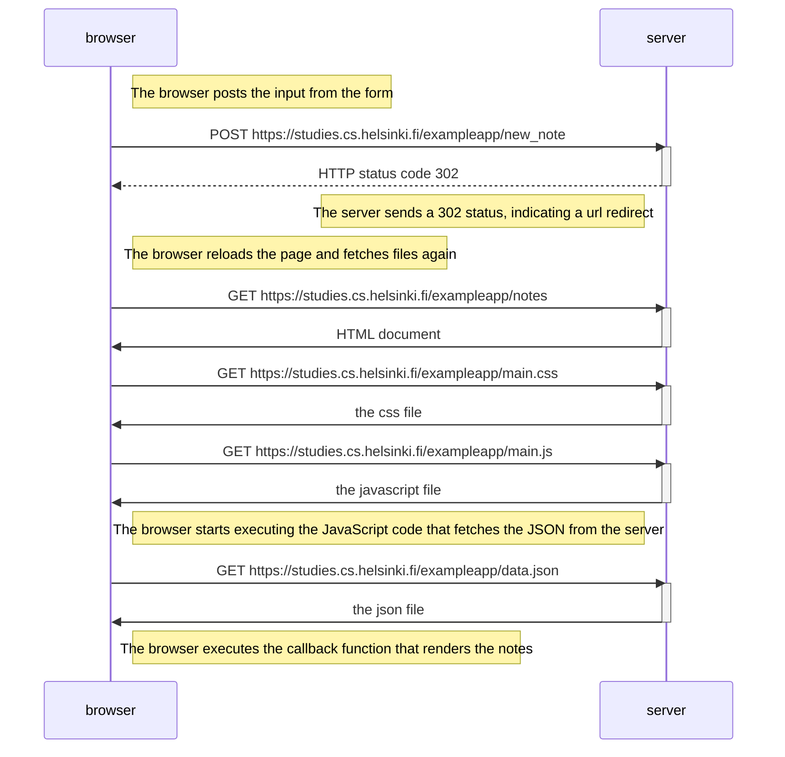

```mermaid
sequenceDiagram
    participant browser
    participant server

    Note right of browser: The browser posts the input from the form

    browser->>server: POST https://studies.cs.helsinki.fi/exampleapp/new_note
    activate server
    server-->>browser: HTTP status code 302
    deactivate server

    Note left of server: The server sends a 302 status, indicating a url redirect

    Note right of browser: The browser reloads the page and fetches files again
        
    browser->>server: GET https://studies.cs.helsinki.fi/exampleapp/notes
    activate server
    server->>browser: HTML document
    deactivate server

    browser->>server: GET https://studies.cs.helsinki.fi/exampleapp/main.css
    activate server
    server->>browser: the css file
    deactivate server

    browser->>server: GET https://studies.cs.helsinki.fi/exampleapp/main.js
    activate server
    server->>browser: the javascript file
    deactivate server

    Note right of browser: The browser starts executing the JavaScript code that fetches the JSON from the server

    browser->>server: GET https://studies.cs.helsinki.fi/exampleapp/data.json
    activate server
    server->>browser: the json file
    deactivate server

    Note right of browser: The browser executes the callback function that renders the notes
```